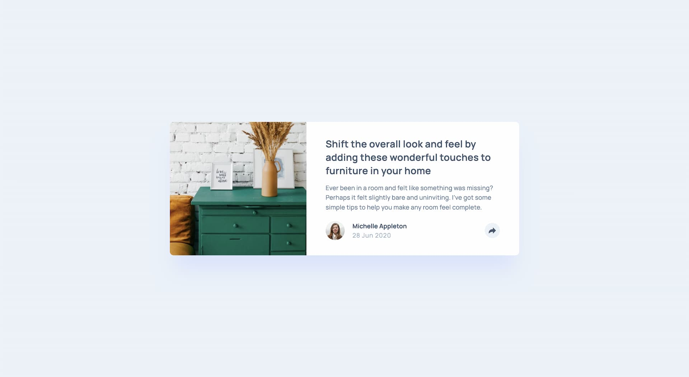

# Frontend Mentor - Article preview component solution

This is a solution to the [Article preview component challenge on Frontend Mentor](https://www.frontendmentor.io/challenges/article-preview-component-dYBN_pYFT). Frontend Mentor challenges help you improve your coding skills by building realistic projects.

## Table of contents

- [Overview](#overview)
  - [The challenge](#the-challenge)
  - [Screenshot](#screenshot)
  - [Links](#links)
- [My process](#my-process)
  - [Built with](#built-with)
  - [What I learned](#what-i-learned)
  - [Continued development](#continued-development)
  - [Useful resources](#useful-resources)
- [Author](#author)
- [Acknowledgments](#acknowledgments)

**Note: Delete this note and update the table of contents based on what sections you keep.**

## Overview

Run the project

```sh
# clone the project
git clone ...

# install packages
pnpm ci

# run the dev server
pnpm dev

# build the project
pnpm build

# preview the built version
pnpm preview
```

> node version : v21.5.0  
> pnpm version : 8.15.0

### The challenge

Users should be able to:

- View the optimal layout for the component depending on their device's screen size
- See the social media share links when they click the share icon

### Screenshot



### Links

- Solution URL: [https://www.frontendmentor.io/solutions/article-preview-component-cssjs-a4MRQYOXa5](https://www.frontendmentor.io/solutions/article-preview-component-cssjs-a4MRQYOXa5)
- Live Site URL: [https://delicate-froyo-cea77b.netlify.app/](https://delicate-froyo-cea77b.netlify.app/)

## My process

### Built with

- Semantic HTML5 markup
- CSS custom properties
- Flexbox
- CSS Grid
- Mobile-first workflow

### What I learned

I learned about the popover html attribute and how it can reduce the need of javascript for the open, close, and light dismissed. This attribute can turn any element into a popover and will be hidden by default. This element will appear above all other element in the top layer and is not influcenced by parent elements' position or overflow styling.

[popover on MDN](https://developer.mozilla.org/en-US/docs/Web/HTML/Global_attributes/popover)

After a while trying to find a way to use this attribute on mobile and desktop I decided to switch back to a classic div and JavaScript functions. I felt I needed to add a lot of markup to respect the figma design between mobile and desktop. The fact that the element is displayed in the top layer made it complicated to style it on mobile as it is contained in the footer part of the card.

I learned also about `anchor-name`. this is an experimental css feature that works in chrome currently. It is an easy way to place a popover over a button for example by giving the button an `anchor-name`.

This is a good article about the popover API and anchor-name

[Future of CSS: Popover API](https://dev.to/link2twenty/future-of-css-popover-api-3ba0)

To use this I would probably need to implement progressive enhancement with an alternative as this feature isn't available on every browsers _yet_.

### Continued development

The drop shadow used on the popover box isn't well supported in safari. I'll have to do some test and add a fix.

## Author

- Website - [Gwenaël Magnenat](https://gmagnenat.com)
- Frontend Mentor - [@gmagnenat](https://www.frontendmentor.io/profile/gmagnenat)
- LinkedIn - [@gmagnenat](https://www.linkedin.com/in/gmagnenat)

## Acknowledgments

[Alex Marshall](https://github.com/AlexKMarshall) for the tip about the popover attribute.
